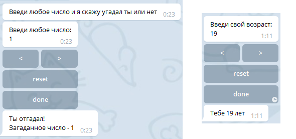

# python-telegram-bot-addons
Небор расширений для библиотеки [python-telegram-bot](https://github.com/python-telegram-bot/python-telegram-bot).

#### TextMessage

Просто удобная обертка для передачи параметров методам `telegram.bot.send_*`, `telegram.bot.edit_*`
 и `telegram.Message.reply_text()`

```Python
message = TextMessage("Hello world!", reply_markup=generate_markup)
update.message.reply_text(**message)
```

#### InlineKeyboardMarkupExt

Переопределяет `InlineKeyboardMarkup`, добавляя возможность
отложенного добавления разметки.

```Python
keyboard = InlineKeyboardMarkupExt()

button1 = InlineKeyboardButton("1", callback_data='1')
button2 = InlineKeyboardButton("2", callback_data='2')
keyboard.add_line(button1, button2)

button_ok = InlineKeyboardButton("save", callback_data='save')
keyboard.add_line(button_ok)

message = TextMessage("Example `InlineKeyboardMarkupExt`",
                      parse_mode="Markdown",
                      reply_markup=keyboard)
```


#### ConversationHandlerExt

> Черновой вариант

`При написании модулей может потребоваться функционал включения/отключения обработчиков. Для того
чтобы сильно не завязываться на работе с диспатчером и постоянным добавлением/удалением ссылок
реализован набор классов с возможностью временного отключения обработчика.` Расширяет оригинальный `ConversationHandler` возможностью вручную установить `state`. В связи с
тем, что состояния теперь могут устанавливаться из пользовательского кода, то параметры
`entry_points` и `fallbacks` теперь опциональны.


```Python
# Реализуем обработчик, добавляющий любой текстовый ввод в некую функцию
ANY_TEXT_INPUT = range(1)
conv_handler = ConversationHandlerExt(
    states={
        ANY_TEXT_INPUT: [MessageHandler(Filters.text, input_add)],
    },
    fallbacks=[CommandHandler('done', input_done), ])
...
# Обработчик будет активироваться только из указанной Функции-точки входа в модуль
def start(bot, update):
    conv_handler.set_state(update, ANY_TEXT_INPUT)
    update.message.reply_text("Введите любой текст и я его сохраню."\
                              "Введите /done чтобы закончить ввод.")
```

#### SimpleHandler

Удобный и в тоже время очень простой способ структурирования кода. Все связанные по смыслу
обработчики помещаются в наследника данного класса.

```Python
class HelpHandler(SimpleHandler):

  def bind_handlers(self, dispatcher):
    dispatcher.add_handler(CommandHandler("help", help))

  def help(self, bot, update):
    update.message.reply_text("Type /start for start")

HelpHandler(dispatcher)
dispatcher.start_polling()
```

## Компоненты

Наиболее сложный момент библиотеки.

Компонент по сути представляет собой кусок кода с возможностью переиспользования... При реализации
концепции компонентов в первую очередь стояла задача обеспечить наиболее прозрачный и понятный
для разработчиков использующих `python-telegram-bot` процесс написания кода. Компонент имеет
точку входа и точку выхода. По окончанию работы компонент оповещает функцию обратного вызова о
сгенерированных/полученных от пользователя/... данных. Пример: компонент для ввода даты, который
используется в настройках и при регистрации пользователя независимо друг от друга. Отдельным
преимуществом компонентов является отсутствие накладных ресурсов на хранения состояния
взаимодействия с пользователем (см. `InlineKeyboardButtonExt`).

Для понимания самой концепции компонентов необходимо сначала ознакомиться с примитивами, которые
работают только в контексте компонентов.

### InlineKeyboardButtonExt

Модифицированный `telegram.InlineKeyboardButton`, расширен возможностью "умного" роутинга путем
указания строчного параметра `command`. Ограничение по передаваемым данным в параметре `callback_data`
\- 55 символов.

```Python
InlineKeyboardButtonExt(text="<",
                        command="reduce_value",
                        callback_data="some_data")
```

### CallbackQueryHandlerExt

Обработчик, основной задачей которого является обработка `InlineKeyboardButtonExt`.

```Python
CallbackQueryHandlerExt("reduce_value", self.reduce_handler)
```

### ComponentHandler

Сердце и основной механизм для реализации переиспользуемых компонентов. Процесс создания компонента
очень схож с процессом описания обработчиков основанных на `SimpleHandler`, с тем лишь отличием,
что в конструкторе необходимо предусмотреть передачу имени компонента. ИМЯ КОМПОНЕНТА ДОЛЖНО БЫТЬ УНИКАЛЬНО ДЛЯ КАЖДОГО ЭКЗЕМПЛЯРА! (именно на уникальном имени и основывается концепция переиспользования).

Рассмотрим реализацию конструктора на примере счетчика (полный исходный код примера находится в папке `examples/component`).

```Python
class CounterComponent(ComponentHandler):
    def __init__(self, dispatcher, namespace):
        component_name = namespace + "_counter"
        super().__init__(component_name, dispatcher)
```

Теперь перейдем к определению точки входа в компонент.

```Python
    # необходимо переопределить функцию с именем _start
    # которая в свою очередь вызывается из метода start, определенного в ComponentHandler
    def _start(self, bot, update):
        self.counter_show(bot, update)
```

Процесс вызова компонента выглядит совсем просто:

```Python
CounterComponent(dispatcher, "age").start()
```

Для получения более детальной информации подготовлен небольшой пример, в котором реализован
простой компонент-счетчик. Данный компонент используется в игре "угадай-число" и при вводе-возраста. Полный пример кода находится в `examples/component`.



###### Todo
- [ ] Тестами покрыть
- [ ] Обосновать и в случае успешного обоснования реализовать инлайновые кнопки с безразмерным параметром callback_data
