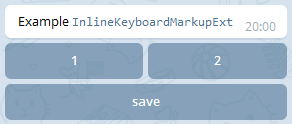

# python-telegram-bot-addons
Небор расширений для библиотеки [python-telegram-bot](https://github.com/python-telegram-bot/python-telegram-bot).

#### TextMessage

Просто удобная обертка для передачи параметров методам `telegram.bot.send_*`, `telegram.bot.edit_*`
 и `telegram.Message.reply_text()`

```Python
message = TextMessage("Hello world!", reply_markup=generate_markup)
update.message.reply_text(**message)
```

#### InlineKeyboardMarkupExt

Переопределяет `InlineKeyboardMarkup`, добавляя возможность
отложенного добавления разметки.

```Python
keyboard = InlineKeyboardMarkupExt()

button1 = InlineKeyboardButton("1", callback_data='1')
button2 = InlineKeyboardButton("2", callback_data='2')
keyboard.add_line(button1, button2)

button_ok = InlineKeyboardButton("save", callback_data='save')
keyboard.add_line(button_ok)

message = TextMessage("Example `InlineKeyboardMarkupExt`",
                      parse_mode="Markdown",
                      reply_markup=keyboard)
```



#### ConversationHandlerExt

> Черновой вариант

`При написании модулей может потребоваться функционал включения/отключения обработчиков. Для того
чтобы сильно не завязываться на работе с диспатчером и постоянным добавлением/удалением ссылок
реализован набор классов с возможностью временного отключения обработчика.` Расширяет оригинальный `ConversationHandler` возможностью вручную установить `state`. В связи с
тем, что состояния теперь могут устанавливаться из пользовательского кода, то параметры
`entry_points` и `fallbacks` теперь опциональны.


```Python
# Реализуем обработчик, добавляющий любой текстовый ввод в некую функцию
ANY_TEXT_INPUT = range(1)
conv_handler = ConversationHandlerExt(
    states={
        ANY_TEXT_INPUT: [MessageHandler(Filters.text, input_add)],
    },
    fallbacks=[CommandHandler('done', input_done), ])
...
# Обработчик будет активироваться только из указанной Функции-точки входа в модуль
def start(bot, update):
    conv_handler.set_state(update, ANY_TEXT_INPUT)
    update.message.reply_text("Введите любой текст и я его сохраню."\
                              "Введите /done чтобы закончить ввод.")
```

## Компоненты

#### SimpleHandler

Удобный и в тоже время очень простой способ структурирования кода. Все связанные по смыслу
обработчики помещаются в наследника данного класса.

```Python
class HelpHandler(SimpleHandler):

  def bind_handlers(self, dispatcher):
    dispatcher.add_handler(CommandHandler("help", help))

  def help(self, bot, update):
    update.message.reply_text("Type /start for start")

HelpHandler(dispatcher)
dispatcher.start_polling()
```

###### Todo
- [ ] Тестами покрыть
- [ ] Добавить пример с компонентами, счетчиком и добавлением текста
- [ ] Обосновать и реализовать прокси-обработчик с возможностью отключения
- [ ] Обосновать и в случае успешного обоснования реализовать инлайновые кнопки с безразмерным параметром callback_data
